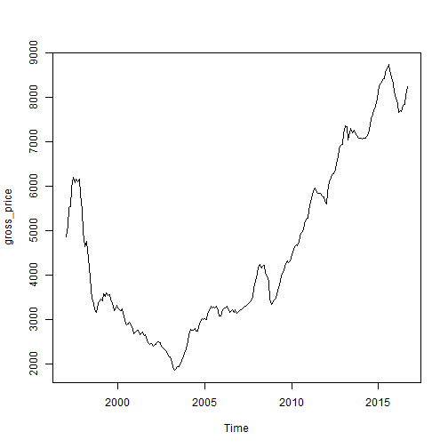
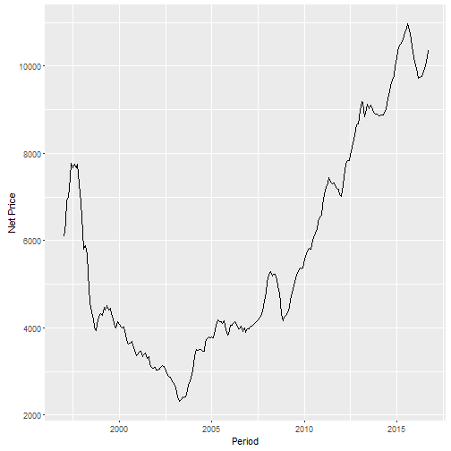
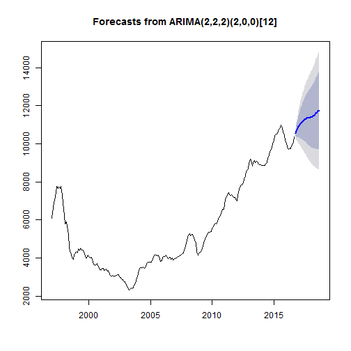

## 美聯物業樓價

This handy R script is created to extract Hong Kong **Gross** and **Net** property prices from the Hong Kong Property Agency Midland 美聯物業 available on <http://proptx.midland.com.hk/mpp/main.jsp?lang=zh> for rapid machine learning.

### Data Collection
Hong Kong Property Price Movement is sourced from Midland Realty available from 1997 onwards.

```r
url <- "http://resources.midland.com.hk/json/common/price.json?t="
```

### Web Scraping
Read data from the above link in JSON format into R.

```r
require(jsonlite)
flat_data<-fromJSON(url)
period<-flat_data$x_axis$labels$labels
Price<-flat_data$elements
```

###Data manipulation

```r
net_price<-as.data.frame(Price$values[[1]])
gross_price<-as.data.frame(Price$values[[2]])
```

Variable Names

```r
names(net_price)[1]<-"net_price"
names(gross_price)[1]<-"gross_price"
```

Add Time dimension 

```r
library(dse)
starttime=c(1997,1);endtime=c(2016,9);freq=12
flat_net_price<-ts(net_price,start=starttime,end=endtime,frequency=freq)
flat_gross_price<-ts(gross_price,start=starttime,end=endtime,frequency=freq)
```


```r
plot(flat_gross_price)
```



```r
plot(flat_net_price)
```


### Data Visualization
Net Price 平均實用樓價

```r
library(zoo)
library(ggplot2)
library(scales)

hk_flat_net_price<-autoplot(as.zoo(flat_net_price), geom = "line")+
  xlab("Period") +
  ylab("Net Price") 

hk_flat_net_price
```



Export

```r
ggsave(filename="../DataOut/hk_flat_net_price.png",plot=hk_flat_net_price)
```

### ARIMA Modelling
According to the ARIMA model, Hong Kong property price is estimated to edge upwards given that other factors remain unchanged.

ARIMA is a time series model that attempts to separate the signal from the noise and the signal is then extrapolated into the future to obtain forecasts.
The model consist of lags of the dependent variable.

A seasonal ARIMA model is classified as an "ARIMA(p,d,q)x(P,D,Q)" model, where:

p is the number of autoregressive terms,

d is the number of nonseasonal differences needed for stationarity,

q is the number of lagged forecast errors in the prediction equation,

P is the number of seasonal autoregressive terms,

D is the number of seasonal differences,

Q is the number of seasonal moving average terms.


ARIMA Model is very common on financial analysis such as stock market. It can also apply to other area such as house price.
Dr Raymond Tse published a paper called "An application of the ARIMA model to real-estate prices in Hong Kong." <http://citeseerx.ist.psu.edu/viewdoc/download?doi=10.1.1.196.4606&rep=rep1&type=pdf>

September 2016 witnessed the price reach above 10,000 price per square feet, which is the same level as last year Feb.


```r
library(forecast)
fit<-auto.arima(flat_net_price)
summary(fit)
```

```
## Series: flat_net_price 
## ARIMA(2,2,2)(2,0,0)[12]                    
## 
## Coefficients:
##          ar1     ar2      ma1      ma2     sar1    sar2
##       0.0639  0.3121  -0.5317  -0.4447  -0.0941  0.0914
## s.e.  0.9396  0.4889   0.9583   0.9396   0.0778  0.0836
## 
## sigma^2 estimated as 16712:  log likelihood=-1474.23
## AIC=2962.46   AICc=2962.95   BIC=2986.67
## 
## Training set error measures:
##                    ME    RMSE     MAE       MPE     MAPE      MASE
## Training set 2.442983 127.076 90.6155 0.1384274 1.782769 0.1172682
##                     ACF1
## Training set -0.01424128
```

```r
fitted(fit)
```

```
##            Jan       Feb       Mar       Apr       May       Jun       Jul
## 1997  6085.277  6403.479  6733.046  7379.988  7192.875  7817.294  8090.995
## 1998  6603.319  5826.648  5510.282  5957.922  5525.411  4948.138  4183.586
## 1999  4327.131  4361.977  4250.650  4530.814  4450.849  4573.579  4301.854
## 2000  4162.940  4041.964  3984.227  3962.815  3970.938  3685.792  3545.729
## 2001  3303.797  3382.767  3472.541  3436.379  3277.841  3371.904  3430.698
## 2002  3064.890  2992.888  3014.987  3068.610  3076.878  3120.905  3118.281
## 2003  2712.659  2643.131  2445.978  2308.415  2235.768  2379.370  2433.251
## 2004  2988.471  3294.586  3486.199  3577.440  3479.359  3483.140  3516.232
## 2005  3735.545  3783.065  3756.130  4046.581  4152.506  4247.133  4129.499
## 2006  3882.781  4166.617  4063.229  4092.940  4162.331  4078.545  3894.315
## 2007  3984.955  3989.436  4043.397  4066.732  4111.052  4141.675  4137.563
## 2008  4960.404  5173.295  5318.167  5343.603  5123.972  5247.847  5257.124
## 2009  4270.216  4303.335  4383.712  4549.192  4728.314  4907.033  5090.167
## 2010  5415.376  5680.929  5680.617  5797.961  5894.997  5790.540  5954.090
## 2011  6591.002  6943.394  7243.110  7326.043  7420.017  7516.119  7290.576
## 2012  6999.764  6976.561  7440.819  7817.084  7846.334  7911.844  7862.506
## 2013  8719.424  9152.391  9331.186  9182.552  8692.537  9068.438  9239.542
## 2014  8895.532  8893.465  8899.088  8932.248  8865.483  8954.104  9112.308
## 2015 10149.126 10339.755 10590.419 10537.645 10587.544 10690.268 10848.142
## 2016 10053.286  9931.547  9777.692  9655.770  9745.277  9780.223  9985.415
##            Aug       Sep       Oct       Nov       Dec
## 1997  7708.171  7861.975  7725.726  7850.026  7093.417
## 1998  4179.198  4090.561  3857.212  3922.372  4313.495
## 1999  4441.953  4245.354  4119.388  3807.541  3955.384
## 2000  3582.555  3631.289  3716.413  3579.510  3354.167
## 2001  3210.304  3314.224  3074.483  3028.337  3052.946
## 2002  2943.233  2927.395  2823.745  2829.011  2713.885
## 2003  2370.458  2415.153  2625.839  2757.481  2843.279
## 2004  3416.865  3457.582  3785.923  3786.873  3801.313
## 2005  4139.325  4077.684  4189.457  3853.996  3751.491
## 2006  3995.558  4082.762  3885.319  4026.687  3836.267
## 2007  4206.507  4284.610  4256.179  4465.266  4755.554
## 2008  5031.704  4859.262  4731.283  4036.369  4051.049
## 2009  5142.135  5309.506  5435.233  5408.547  5329.549
## 2010  6168.760  6229.476  6266.750  6572.247  6648.582
## 2011  7301.258  7352.540  7229.223  7174.339  7191.285
## 2012  8026.770  8283.814  8460.766  8682.604  8744.610
## 2013  8984.448  9136.539  9015.217  8898.207  8883.675
## 2014  9392.285  9553.033  9665.065  9759.907  9858.293
## 2015 10942.030 11046.577 10778.328 10526.379 10381.472
## 2016  9970.628 10223.197
```

```r
forecast_fit<-forecast(fit)
plot(forecast_fit)
```



Please note that the ARIMA Model is assumed other factors remain unchanged given that the US interest rate would remain the same while Hong Kong remains on track.  The Model also ignores the 20 years big cycle and 10 years minor cycle for the Hong Kong Property Market.


